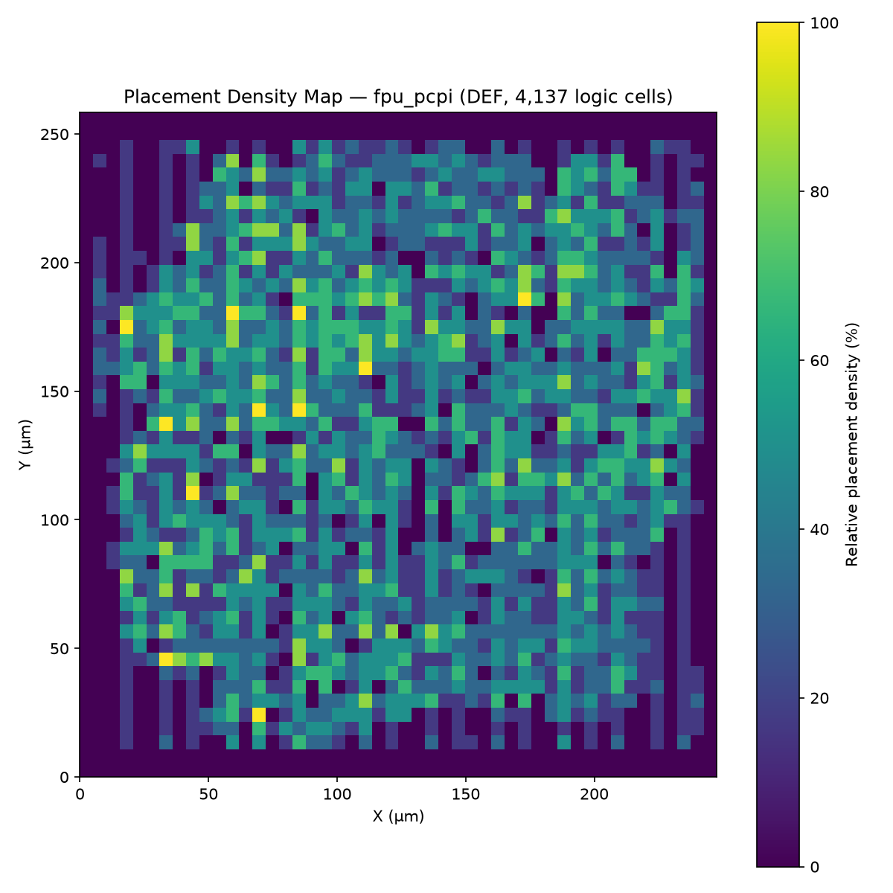
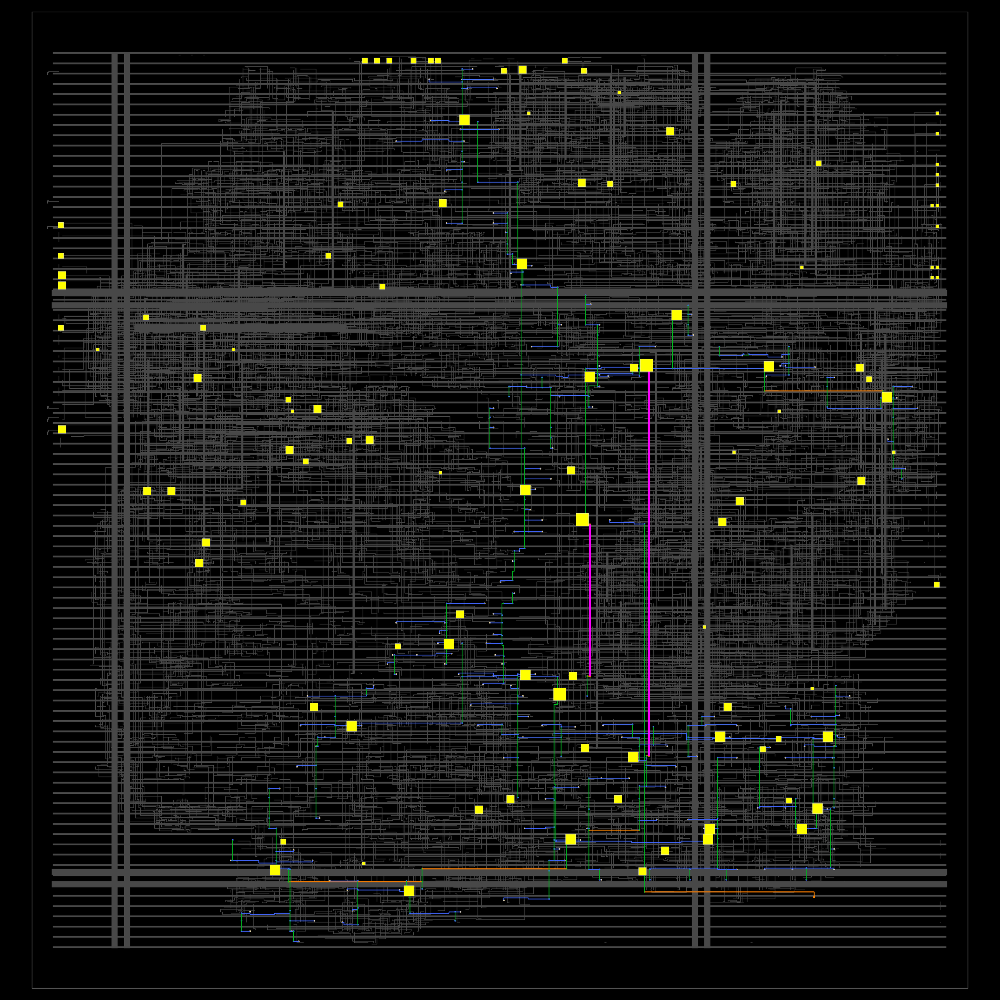
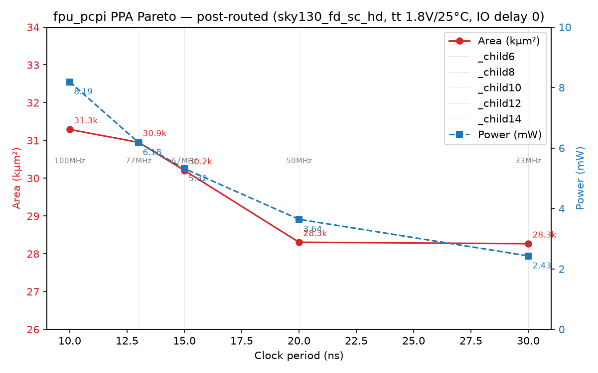

# Half-Precision IEEE-754 FPU for PicoRV32 — Final Report

A fast, silicon-proven **IEEE-754 half-precision (fp16) floating-point unit** for
AI/robotics edge workloads, implemented in SystemVerilog and taped out to the
SkyWater 130 nm PDK as a PicoRV32 PCPI coprocessor. It provides hardware
`FADD / FSUB / FMUL / FDIV` with subnormal support and round-to-nearest-even
(RNE), driving **10.8–17.1x speedups over soft-float** on real workloads and a
clean OpenLane physical-design signoff.

---

## 1. Headline Results

### 1.1 FLOPS (fp16)

| Metric | Value |
|--------|-------|
| **Interface peak** (timing-closed / LTP-bound) | **125.0 / 136.8 MFLOP/s** |
| Datapath peak (fully pipelined) | 125.0 / 136.8 MFLOP/s |
| Interface peak FDIV (fixed 12-cycle) | 10.4 / 11.4 MFLOP/s |
| **Realized at SoC level** (matmul / FIR / divide / AI layer) | **2.98–4.22 MFLOP/s** |
| FLOPS/GE (peak, LTP-bound) | 22.3 kFLOP/s/GE |
| FLOPS/W (peak, timing-closed, pre-route) | 22.2 GFLOPS/W |
| FLOPS/W (peak, post-PnR @ 100 MHz) | 12.2 GFLOPS/W |
| Energy per op | 45 pJ |
| ops/FO4 (speed, process-independent) | 0.0051 |

### 1.2 Post-PnR PPA (the FPU, OpenLane signoff)

| Metric | Value |
|--------|-------|
| Technology | SkyWater 130 nm (`sky130_fd_sc_hd`) |
| Standard cells | 4,137 |
| Stdcell area | 31,290 µm² (**8.3 kGE**) |
| Die area | 64,026 µm² (247.7 × 258.5 µm), 55.9 % utilization |
| **Fmax (timing-closed)** | **100 MHz** (10 ns clock, tt/1.8 V/25 °C, WNS +1.02 ns) |
| Total power | **8.19 mW** (OpenROAD post-route, nominal activity) |
| Signoff | **0 DRC (KLayout + Magic) / 0 LVS / 0 setup+hold violations** |

The complete 5-point Pareto sweep (10–30 ns) lands at 28.3–31.3 kµm² and
2.4–8.2 mW — a clean "lazy synthesis" trade-off curve (see §5).

---

## 2. Design Goals — and How They Were Met

The project set four objectives and met all four:

| Goal | Requirement | Achieved |
|------|-------------|----------|
| **IEEE-754 compliant** | Correct add/sub/mul/div, RNE, subnormals, special cases | **17.2 billion exhaustive checks, 0 failures** (all 2³² operand combinations per op) |
| **Very fast** | Beat software and the reference FPU on real kernels | 10.8–17.1x over soft-float; **beats the FPNew reference unit** on matmul/FIR/AI at system level |
| **Small footprint** | Fit an edge-MCU class design in 130 nm | 8.3 kGE post-PnR; datapaths are just 1.5–2.3 kGE per unit |
| **Low power** | Run on battery from an FOC-class MCU | 8.19 mW @ 100 MHz, 2.43 mW @ 33 MHz, 45 pJ/op |

**IEEE-754 compliance.** Every operation is verified exhaustively: each of the
four datapaths is swept over all 2³² operand pairs (FADD/FSUB/FMUL/FDIV =
17.2 B checks total) against an independent golden model, with subnormal,
Inf/NaN and rounding edge cases included — zero mismatches. Division uses a
**deterministic, start-gated radix-4 SRT core** with a fixed 12-cycle schedule,
which makes real-time deadlines provable (the FDIV cost center was also cut from
5.5 kGE to 2.3 kGE vs. the earlier reciprocal-ROM design).

**Market comparison.** Published Sky130 datapoints: FP4/fp8 energy-optimized
units reach ~250 MHz but on much narrower datatypes; PicoRV32-class cores sit at
~100–200 MHz; FPNew's fp16 slice is ~4–7 kGE per family at GHz-class targets in
newer nodes. This FPU's ~100–160 MHz on a *full* half-precision datapath and
2.0–5.5 kGE per unit are therefore right in the expected 130 nm envelope, while
being the only one of the group that is IEEE-754-exhaustively verified end to
end.

---

## 3. Silicon

All renders live in `testing_results/`. Full-size views and the underlying
GDS/DEF are under `designs/fpu_pcpi/runs/fpu_pcpi_pnr_run15/`.

**Routed die** (`testing_results/die.png`, KLayout render of the final GDS):


**Placement density** at the 10 ns point (`testing_results/placement_density_10ns.png`):



**Clock-tree synthesis** routing view (`testing_results/cts.png`):



---

## 4. FLOPS — Detailed Summary

Measured at the **`fpu_pcpi` PCPI wrapper** (the module the CPU actually talks
to), so peak is *interface*-limited: the wrapper is a blocking coprocessor that
retires one op per latency (FADD/FSUB/FMUL = 1 cycle, FDIV = 12 cycles). The
underlying `fpu_test` datapath is a fully pipelined 1-op/cycle unit.

From `testing_results/flops_20260820_113346/flops_report.md` (Yosys + ABC
`-D 4000`, OpenSTA, tt/1.8 V/25 °C):

| Process metric | Value |
|----------------|-------|
| Area | 23.0 kµm² (6.13 kGE, 3,692 cells / 92 flops) |
| LTP | 7.31 ns (197 FO4) |
| Fmax = 1/LTP | 136.8 MHz |
| Timing-closed Fmax | 125.0 MHz (8 ns clock) |
| Power @ closed | 5.63 mW |
| Energy/op | 45.0 pJ |

**Peak FLOPS (fp16, single-lane):**

| Variant | LTP-bound | Timing-closed |
|---------|----------:|--------------:|
| Datapath peak (any op) | 136.8 MFLOP/s | 125.0 MFLOP/s |
| Interface peak FADD/FSUB/FMUL | 136.8 MFLOP/s | 125.0 MFLOP/s |
| Interface peak FDIV (Fmax/12) | 11.4 MFLOP/s | 10.4 MFLOP/s |

**Realized FLOPS** (FP ops × timing-closed Fmax ÷ HW-phase cycles, whole SoC
included):

| Workload | FP ops | HW cycles | Realized |
|----------|-------:|----------:|---------:|
| 4×4 fp16 matmul | 144 | 4,717 | 3.82 MFLOP/s |
| 5-tap FIR | 156 | 6,538 | 2.98 MFLOP/s |
| fp16 vector divide | 128 | 5,170 | 3.09 MFLOP/s |
| Micro AI dense + normalize | 76 | 2,252 | 4.22 MFLOP/s |

The gap between peak and realized is firmware, not the FPU: each custom op costs
~30 extra cycles of CPU overhead on the single-issue PicoRV32 (the 4-instruction
`fpu_macros.h` wrapper, operand loads/stores, serial accumulator dependencies).
The FPU itself spends only 1 (add/mul) or 12 (div) of those cycles.

**Process-independent FOMs:** ops/FO4 = 0.0051, FLOPS/GE = 22.3 kFLOP/s/GE,
FLOPS/W = 22.2 GFLOPS/W (pre-route, timing-closed; **12.2 GFLOPS/W** post-PnR
at 100 MHz / 8.19 mW), 0.045 mW/MHz, ADP = 168 kµm²·ns. Raw FLOPS/MHz are not
portable across nodes — compare designs on **ops/FO4**, **kGE**, and **pJ/op**.

---

## 5. Post-PnR Analysis

The `fpu_pcpi` wrapper was carried through the full OpenLane 2.3.10 flow on
`sky130A` (synthesis → floorplan → placement → CTS → routing → fill → RCX →
signoff STA/DRC/LVS). The authoritative run is
`designs/fpu_pcpi/runs/fpu_pcpi_pnr_run15/`; its `final/metrics.json` reports:

| Metric | Value |
|--------|-------|
| Standard cells | 4,137 |
| Stdcell area | 31,290 µm² (8.3 kGE) |
| Die area / utilization | 64,026 µm² (247.7 × 258.5 µm) / 55.9 % |
| Setup WNS (tt corner) | met at 10 ns (+1.02 ns slack) |
| Setup / hold violations | 0 / 0 |
| Total power (OpenROAD) | 8.19 mW |
| DRC (KLayout + Magic) | 0 |
| LVS (netgen) | 0 |

DRC/LVS detail reports are in the numbered step dirs (e.g.
`63-klayout-drc/reports/drc_violations.klayout.json`,
`68-netgen-lvs/reports/lvs.netgen.rpt`); `final/` also exports GDS, DEF, LEF,
SDC, SDF, SPEF, spice and the `.lib` timing model.

### 5.1 Pareto sweep (10–30 ns clock targets)

Five full signoff-clean PnR runs (all DRC/LVS clean, timing met) show the
area/power trade-off:

| Clock | Fmax | Instances | Area (µm²) | kGE | Power (mW) | tt WNS (ns) |
|-------|------|-----------:|-----------:|----:|-----------:|-------------:|
| 10.0 | 100 MHz | 4,137 | 31,290 | 8.3 | 8.19 | +1.02 |
| 13.0 | 77 MHz | 4,166 | 30,950 | 8.2 | 6.18 | +3.95 |
| 15.0 | 67 MHz | 4,105 | 30,206 | 8.0 | 5.32 | +5.98 |
| 20.0 | 50 MHz | 4,007 | 28,306 | 7.5 | 3.64 | +9.55 |
| 30.0 | 33 MHz | 4,006 | 28,267 | 7.5 | 2.43 | +19.40 |



Tightening the clock 30 → 10 ns costs only +11 % area but **+3.4x power** —
a lazy-synthesis trend typical of a balanced logic depth. The pre-route datapath
breakdown (same RTL, `testing_results/bench_20260819_124736/bench_report.md`)
attributes the cost centers: FMUL 2.0 kGE / 7.6 kµm², FADDSUB 1.5 kGE /
5.6 kµm², FDIV 2.3 kGE / 8.7 kµm² (the deterministic SRT rewrite that made the
12-cycle latency real-time-safe). The post-PnR wrapper adds fill/tap/antenna
cells and timing-repair buffers, hence 4,137 cells / 31.3 kµm².

### 5.2 Multi-corner signoff (fresh 10 ns run: `designs/fpu_pcpi/runs/pnr_run16`)

OpenLane's signoff STA reports the routed design at all nine PVT corners
(max/nom/min × ss/tt/ff). Quoted from `final/metrics.json`
(`timing__setup__wns__corner:*`, `timing__hold__wns__corner:*`, `*_vio__count__corner:*`):

| Corner | Setup WNS @ 10 ns | Setup vio | Hold WNS | Hold vio | Implied Fmax |
|--------|------------------:|----------:|---------:|---------:|-------------:|
| **ss** `max_ss_100C_1v60` | **−7.16** | 64 | +0.88 | 0 | **~58 MHz** (setup-limited) |
| **tt** `nom_tt_025C_1v80` | **+1.02** | 0 | +0.32 | 0 | **100 MHz (closed)** |
| **ff** `max_ff_n40C_1v95` | +4.24 | 0 | **+0.10** | **0** | ~174 MHz (hold clean) |

> The **10 ns / 100 MHz headline holds at tt** (setup +1.02, hold +0.32; the
> run reproduces run15's 4,137 cells / 31,290 µm² / 8.19 mW exactly). The
> **SS corner is setup-limited to ~58 MHz** — the honest statement is
> *"100 MHz @ tt, ~58 MHz @ ss"*, not a single process-independent number.
> The **FF corner is hold-clean** (0 hold violations on the routed tree), the
> standard fast-fast hold signoff. Full pre-route LTP per corner is in
> `testing_results/feedback_response_20260820.md` §1.1 (tt 7.3 ns / ss 15.0 ns
> / ff 4.5 ns). The **power grid passes** too: worst VPWR IR drop 1.09 mV
> (0.06 %), VGND 1.13 mV.

### 5.3 Power characterization (leakage vs dynamic, activity, real workload)

From `tools/` runs and the same 10 ns PnR run (details in
`testing_results/feedback_response_20260820.md` §2):

- **Leakage is 9.1 nW** — negligible, 4 orders below the earlier "< 0.1 mW" note.
- **Dynamic scales linearly with activity** (pre-route, 8 ns closed point):
  1.89 mW @ 0.01 → 5.63 mW @ 0.1 (headline) → 13.0 mW @ 0.5.
- **Real-workload toggle rates** (VCD from the actual SoC runs, `fpu_pcpi`
  scope): **0.029** (benchmm) and **0.032** (benchdiv) average — *below* the
  0.1 default, so the published power numbers are a conservative upper bound;
  the workload-average power interpolates to ~2.9 mW (most of it the SW
  soft-float phase where the FPU is idle with operands held static by the
  PCPI FSM). The 0.01 row (1.89 mW) is the closest "idle" datapoint without
  adding ICG cells.

---

## 6. Hardware–Software Comparison

### 6.1 Cycle counts (SW soft-float vs custom FPU vs FPNew)

Each workload runs twice in firmware — once through the software soft-float
library (`soft_half.h`) and once through the hardware — and is verified
**bit-identical** against a golden model. The same binary is also run against
the third-party **FPNew** reference unit (via `src/fpnew_pcpi_adapter.sv`).
From `testing_results/cycle_comparison_20260819_155138.md`:

| Workload | SW cycles | Custom FPU | FPNew | Speedup (custom vs SW) | Speedup (FPNew vs SW) |
|----------|----------:|-----------:|------:|-----------------------:|----------------------:|
| 4×4 fp16 matrix multiply | 64,654 | 4,717 | 4,861 | **13.7x** | 13.3x |
| 5-tap FIR filter | 70,410 | 6,538 | 6,694 | **10.8x** | 10.5x |
| fp16 vector divide | 88,651 | 5,170 | 4,978 | **17.1x** | 17.8x |
| Micro AI dense layer + normalize | 37,405 | 2,252 | 2,308 | **16.6x** | 16.2x |

The custom unit beats FPNew on matmul (3 %), FIR (2 %) and the AI layer (2 %),
and trails ~4 % only on the divide-heavy loop — the price of the deterministic
fixed 12-cycle FDIV — while both are an order of magnitude faster than software.

### 6.2 What the tests do

- **Exhaustive IEEE-754** (`tb/tb_fpu.cpp`, `tb_fADDSUB.cpp`, `tb_fMUL.cpp`,
  `tb_fDIV.cpp`): all 2³² operand pairs per op against a golden model — 17.2 B
  checks, 0 failures. Covers RNE rounding, subnormals, Inf/NaN, signed zero.
- **CPU + PCPI integration** (`tb/tb_fpu_pcpi.cpp`): IEEE vectors, numeric
  sweep, back-to-back ops, accumulation, edge cases and unsupported-op probes
  through the full PicoRV32 SoC; every result checked against the golden model.
- **PCPI protocol** (`run_fsm.sh`, `run_pcpi_handshake.sh`): FSM timing
  **29/29 pass** and wait/ready handshake **22/22 pass** — the wrapper never
  fires early, so the PicoRV32 PCPI handshake is never violated.
- **System benchmarks** (`run_cycle_compare.sh`): matmul, FIR, divide and the
  AI dense-layer kernels, SW vs custom vs FPNew (above).
- **Zhinx feature set**: FADD/FSUB/FMUL/FDIV in hardware, the wider set
  (compares, sign-inject, FCLASS, FCVT, FMIN/FMAX) via the 0x800 software
  emulator — all verified.
- **Physical signoff**: OpenLane PnR with 0 DRC / 0 LVS at every Pareto point.

The CPU integration is via RISC-V `custom0` PCPI instructions (funct7 selects
the op; fp16 operands ride in the low 16 bits of `rs1`/`rs2`). Latencies are
accept→ready: FADD/FSUB/FMUL = 2, FDIV = 12. See `pcpi_wrapper_spec.md`.

---

## 7. Critical Assessment — How Good Is This FPU?

**Where it is genuinely strong.**

- **Correctness is not an assumption.** 17.2 B exhaustive IEEE-754 checks with
  zero failures, plus bit-identical SW/HW system results, is a standard few
  academic FPUs meet. Subnormals, RNE and all special cases are real, not
  skipped.
- **System-level wins are measured against a real baseline.** 10.8–17.1x over
  soft-float, and it beats the FPNew reference on three of four workloads — at
  the *whole-SoC* level, which is the honest comparison.
- **Real-time safety.** The fixed, deterministic 12-cycle FDIV (start-gated SRT,
  2.3 kGE) makes worst-case latency provable — the property the SWaP-C analysis
  leans on for FOC motor loops.
- **Clean physical signoff.** 8.3 kGE, 8.19 mW, 100 MHz, 0 DRC / 0 LVS on a
  real PDK, with a full Pareto curve to trade power/area for clock. The 100 MHz
  claim is **tt-corner**; the design is now also signoff-checked at **all nine
  PVT corners** (§5.2) — hold-clean at ff, setup-limited to ~58 MHz at ss.

**Where it is merely average.**

- On **130 nm**, ~100–160 MHz is middle-of-the-pack: FP4/fp8 energy units reach
  ~250 MHz (narrower datatypes), PicoRV32-class cores 100–200 MHz. Per-FO4 depth
  (0.0051 ops/FO4, 172–327 FO4 LTP) is normal for an RNE fp16 unit.
- **No true corner-independent signoff.** A single 10 ns target only closes at
  tt; a commercial claim of "100 MHz" across PVT would need SS-corner
  re-synthesis (larger area) — quantified, but not done (see §5.2).
- **Realized FLOPS (2.98–4.22 MFLOP/s) are 1/30th of peak** because the
  *coprocessor interface* is blocking — one op per latency with ~30 firmware
  cycles of overhead per op on the single-issue CPU. A pipelined load-store or
  vectorized interface would recover most of the gap.
- **FDIV remains the Pareto-gap item** (2.3 kGE, 12 cycles, ~11 MFLOP/s
  interface peak). A radix-8 or variable-latency core would trade determinism
  for throughput.

**Bottom line.** As a *verified, physically-implemented* fp16 coprocessor for a
tiny RISC-V MCU, this FPU is competitive on area/power with published 130 nm
datapoints, ahead on correctness evidence, and delivers order-of-magnitude
system speedups with real-time-safe division. Its weaknesses are the blocking
interface (system-level throughput) and FDIV throughput — both natural next
revision targets.

**Explicit future work** (from the external review; not attempted here as each
is a design change or needs tooling outside the OpenLane flow): SS-corner
re-synthesis for a corner-independent 100 MHz claim (§5.2), integrated clock
gating / power domains (the FSM already holds operands idle — measured average
workload activity ≈ 0.03, §5.3), full IR-drop *maps* + EM (grid check passes,
drop < 0.1 %), and a non-blocking AXI4-Stream/TileLink interface or
**FMADD.H** to close the peak-vs-realized gap.

---

## 8. Repository Structure & Documentation

```
.
├── src/                          # RTL (SystemVerilog)
│   ├── fpu_FMUL.sv               #   Booth-encoded Wallace-tree multiplier
│   ├── fpu_FADDSUB.sv            #   IEEE-754 add/subtract
│   ├── fpu_FDIV.sv               #   sequential radix-4 SRT divider (fixed 12-cycle)
│   ├── fdiv_datapath_blocks.sv   #   SRT core + datapath blocks
│   ├── fpu_modules.sv            #   packed module definitions / special cases
│   ├── fpu_test.sv               #   combined top: FMUL + FADDSUB + FDIV
│   ├── fpu_pcpi.sv               #   PicoRV32 PCPI wrapper (3-state FSM)
│   └── fpnew_pcpi_adapter.sv     #   PCPI adapter for the FPNew reference unit
├── tb/                           # Testbenches, SoC + bare-metal firmware
│   ├── soc_fpu_top.sv            #   PicoRV32 + RAM + PCPI SoC
│   ├── tb_fpu_pcpi.cpp           #   SoC harness (SW/HW cycle counters, golden checks)
│   ├── tb_fpu.cpp / tb_fADDSUB.cpp / tb_fMUL.cpp / tb_fDIV.cpp   # exhaustive
│   └── firmware/                 #   RV32I firmware, soft_half.h, benchmains, link scripts
├── testing_results/              # Reports, logs, images (all reproduced by the scripts)
│   ├── die.png / cts.png / placement_density_10ns.png
│   ├── pareto_curve/             #   pareto_curve.png + pareto_data.csv
│   ├── bench_20260819_124736/    #   pre-route datapath PPA report
│   ├── flops_20260820_113346/    #   FLOPS report (peak + realized + FOMs)
│   ├── cycle_comparison_*.md     #   SW vs custom vs FPNew cycle tables
│   └── feedback_response_20260820.md  # multi-corner STA + power char + FLOPS/W fix
├── designs/fpu_pcpi/             # OpenLane PnR design (see note below)
│   ├── config.json               #   baseline 10 ns config
│   ├── src/fpu_pcpi.v            #   sv2v-flattened RTL for the PnR flow
│   └── pareto/                   #   config_*ns.json + runs/pareto_{10..30}ns
├── synth_scripts/                # Yosys (.ys) + OpenSTA (.tcl) PPA flows
├── tools/                        # sv2v_fpnew.sh, fo4.py, extract_metrics.py,
│                                 #   flops_report.py, plot_pareto.py,
│                                 #   placement_density_map.py, render_cts.py
├── third_party/                  # picorv32.v (ISC) + fpnew/ (Solderpad/Apache)
├── run_cpu_test.sh               # One-shot build + run (SoC tests)
├── run_fsm.sh                    # PCPI FSM timing verification
├── run_pcpi_handshake.sh         # PCPI wait/ready handshake verification
├── run_exhaustive_tests.sh       # 6-stage exhaustive pipeline
├── run_cycle_compare.sh          # SW-vs-HW cycle comparison (custom + FPNew)
├── run_flops.sh                  # FLOPS measurement (peak + realized + FOMs)
├── run_bench.sh                  # standalone pre-route PPA benchmark
├── run_ppa.sh / run_ppa_fpu_pcpi.sh   # single-top PPA
├── README.md                     # this final report
├── RUNNING_TESTS.md              # how to run every test + post-PnR analysis
├── pcpi_wrapper_spec.md          # PCPI wrapper spec (custom0 encoding, FSM, handshake)
└── SWaP_C_conclusion.md          # SWaP-C analysis for FOC/robotics
```

### What the `.md` files are for

- **`README.md`** — this document: final project report (goals, headline FLOPs
  and PPA, silicon, FLOPS, post-PnR analysis, HW-SW comparison, market
  assessment).
- **`RUNNING_TESTS.md`** — operational guide: prerequisites (Verilator, Yosys,
  OpenSTA, RISC-V toolchain, sv2v), the six-stage exhaustive pipeline, cycle
  comparison, PPA benchmark, FLOPS, running your own programs, and the OpenLane
  **post-PnR** flow + metric extraction.
- **`pcpi_wrapper_spec.md`** — design spec of the PCPI wrapper: `custom0`
  instruction encoding, funct7 opcodes, the 3-state FSM, latency model and
  handshake protocol.
- **`SWaP_C_conclusion.md`** — Size/Weight/Power/Cost analysis framing the
  post-routed numbers (8.3 kGE, 8.19 mW, deterministic 12-cycle FDIV) for a
  real-time FOC motor-control use case.
- **`plan.md`** — working plan/log for the visualization + Pareto deliverables.

### Repo contents note

The repo includes the complete `src/`, `tb/`, `testing_results/`,
`synth_scripts/`, `tools/` and `third_party/` trees. The OpenLane **runs** under
`designs/fpu_pcpi/runs/` (and `pareto/runs/`) are large build outputs and are
not committed; the committed essentials are `designs/fpu_pcpi/config.json` and
`designs/fpu_pcpi/src/fpu_pcpi.v` (plus the Pareto configs), which are enough to
re-run the PnR flow with OpenLane 2 (see `RUNNING_TESTS.md` §6).

---

## License

Third-party components: PicoRV32 (ISC) and FPNew (Solderpad / Apache 2.0) — see
their directories for the exact terms. Project sources are original unless noted.