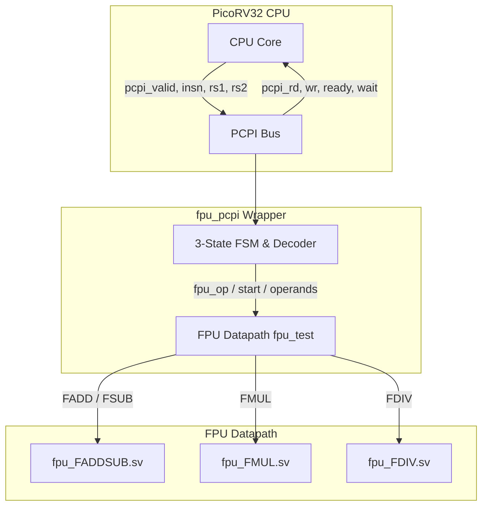
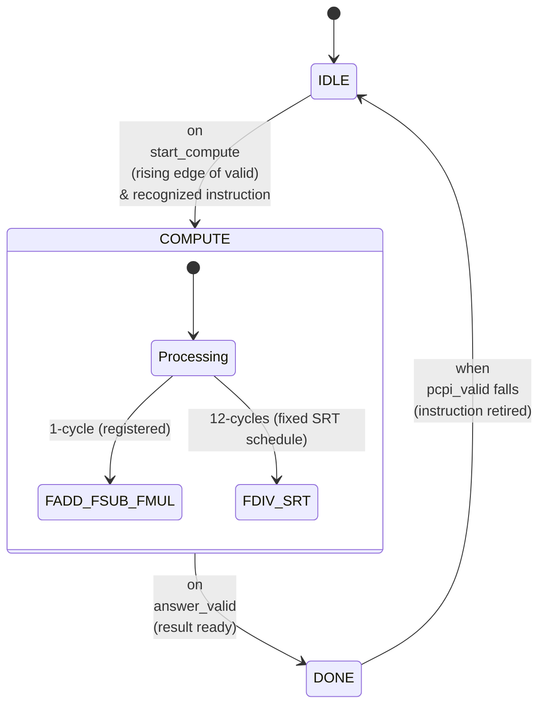
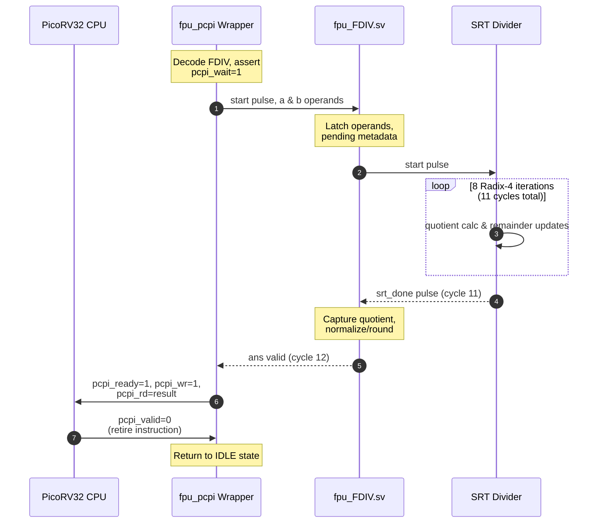

# Half-Precision (fp16) FPU Architecture Documentation

This document provides a conceptual overview and flowcharts for the half-precision IEEE-754 FPU coprocessor (`fpu_pcpi`) integrated with the PicoRV32 RISC-V processor.

---

## 1. System Architecture & Overview

The system consists of the **PicoRV32 CPU core** communicating with the **`fpu_pcpi` coprocessor wrapper** over the Pico Co-Processor Interface (PCPI). The FPU supports four core arithmetic operations (`FADD`, `FSUB`, `FMUL`, `FDIV`) in half-precision format (`binary16`).

### Operation Summary
- **FADD / FSUB**: Single-cycle registered arithmetic datapath (Adder/subtractor with exponent alignment and normalization).
- **FMUL**: Booth-encoded Wallace-tree multiplier with single-cycle registered pipeline stage.
- **FDIV**: Sequential radix-4 SRT divider with fixed 12-cycle deterministic latency.

---

## 2. PCPI Protocol & FSM Control Flow

The `fpu_pcpi` wrapper implements a 3-state Finite State Machine (`IDLE` → `COMPUTE` → `DONE`) to manage the handshake with the PicoRV32 CPU.

### Handshake Semantics
1. **`pcpi_valid`**: Level signal asserted by the CPU when executing an unhandled instruction. It stays high until `pcpi_ready` is asserted.
2. **`pcpi_wait`**: Asserted immediately upon instruction acceptance to stall the CPU and suppress illegal-instruction timeouts.
3. **`pcpi_ready` & `pcpi_wr`**: Asserted together for exactly **one cycle** when the result is valid, writing back `pcpi_rd` into the destination register (`rd`).

---

## 3. FDIV Operation & Start-Gated SRT Divider Flow

Division (`FDIV`) is the most complex operation, utilizing a deterministic, start-gated radix-4 SRT core that operates over a fixed 12-cycle schedule.

### SRT Divider Core Details (`fdiv_datapath_blocks.sv`)
- **Radix-4 Division**: Computes two bits of quotient per clock cycle using redundant digit representation.
- **Start-Gated Control**: The core remains idle between divisions. A single `start` pulse reloads operands, runs 8 iterations, and signals completion via `srt_done` 11 cycles later.
- **Deterministic Latency**: Guarantees worst-case execution time (WCET) for real-time control loops such as Field-Oriented Control (FOC) motor drivers.
